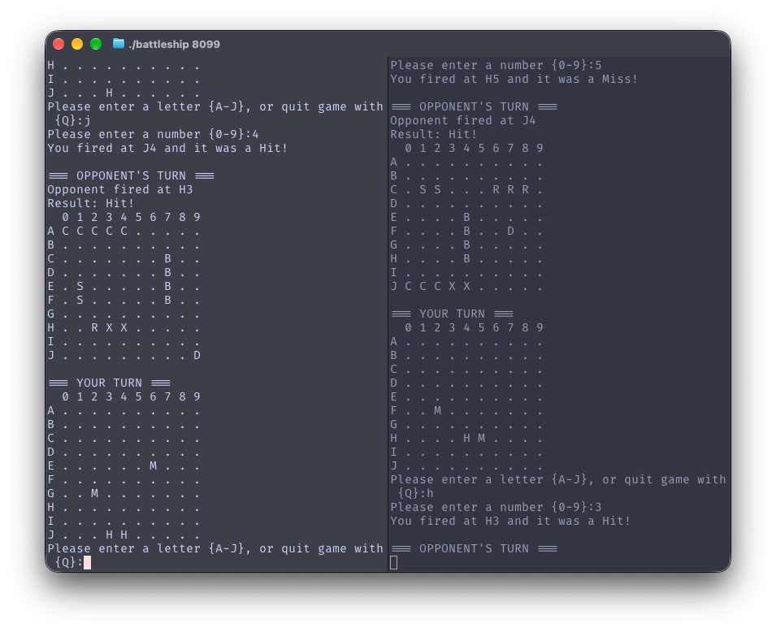

# Battleship

Battleship over a network, written in C with nothing beyond the POSIX socket API. Place ships on a 10x10 grid and take turns firing at coordinates, either solo against a CPU or head to head with another player over TCP.



## Quick start

```bash
gcc -Wall -Wextra -o battleship battleship.c
```

The program runs in three modes, chosen by argument count.

```bash
./battleship                    # solo, against a random-firing CPU
./battleship 8080               # server, hosting a game on a port
./battleship 127.0.0.1 8080     # client, connecting to a server
```

The server takes the first turn. To try the networked mode on one machine, run the server in one terminal and the client in another with `127.0.0.1` as the address.

## How the networking works

Both modes reach the network through `getaddrinfo` with `AF_UNSPEC`, so a single code path works over IPv4 or IPv6. The server then does `socket`, `setsockopt(SO_REUSEADDR)`, `bind`, `listen` and `accept`; the client does `socket` and `connect`, walking the returned address list until one succeeds.

The wire protocol is deliberately small. The shooter sends a coordinate:

```
C7
```

The defender checks that square against its own grid and replies:

```
Hit!        or        Miss!
```

That is the entire protocol. Each board stays on the machine that owns it, so neither process ever holds the other's ship positions; the network carries only shots and outcomes. When a peer disconnects, `recv` returns zero, the reading side reports the disconnect and exits the game loop rather than acting on a partial read.

## Gameplay

### Ship placement

At the start of the game you place 5 ships on a 10x10 grid. Rows are labeled `A` to `J` and columns `0` to `9`.

| Ship       | Size |
|------------|------|
| Carrier    | 5    |
| Battleship | 4    |
| Cruiser    | 3    |
| Submarine  | 2    |
| Destroyer  | 1    |

**Input formats:**

- **Horizontal:** `C37` places a ship across row C from column 3 to column 7.
- **Vertical:** `CG4` places a ship down column 4 from row C to row G.

Input is case-insensitive. The game rejects placements that go out of bounds or overlap existing ships.

### Taking shots

Each turn you enter a row letter (`A` to `J`) and a column number (`0` to `9`). Enter `Q` at the row prompt to quit.

### Grid display

**Your ships grid:**

| Symbol | Meaning             |
|--------|---------------------|
| `.`    | Empty water         |
| `C`    | Carrier             |
| `B`    | Battleship          |
| `R`    | Cruiser             |
| `S`    | Submarine           |
| `D`    | Destroyer           |
| `X`    | Destroyed ship cell |

**Your shots grid:**

| Symbol | Meaning   |
|--------|-----------|
| `.`    | Untried   |
| `H`    | Hit       |
| `M`    | Miss      |

### Winning

Sink all 5 enemy ships (15 ship cells in total) to win. In single-player mode the CPU fires back each turn at a random untried coordinate.

## Implementation notes

Boards are dynamically allocated 10x10 arrays of enums rather than fixed arrays. Every `malloc` is checked, and a failure part-way through allocating rows frees the rows already allocated before exiting instead of leaking them.

Ship types and shot states are enums (`NO_SHIP`, `DESTROYED`, `CARRIER`, ... and `HIT`, `MISS`, `UNTRIED`) so grid state is self-describing rather than encoded in magic characters, with rendering handled at display time.

The program compiles clean under `-Wall -Wextra` and has been verified leak-free with Valgrind.

### Running Valgrind

Valgrind does not run on Apple Silicon, so the included `Dockerfile` provides an Ubuntu environment with `build-essential` and `valgrind`:

```bash
docker build -t battleship .
docker run -it -v "$PWD":/app battleship
# inside the container:
gcc -g -o battleship battleship.c
valgrind --leak-check=full ./battleship
```

On Linux, or on macOS with `leaks` instead, Docker is unnecessary.

## Notes

Written solo over ten weeks for a systems programming course, in four graded stages: the file grew from 38 lines to 766 across them. Since the course ended I fixed an unchecked `recv` return value that could write out of bounds when a peer disconnected, added the missing `SO_REUSEADDR` so the server can rebind its port immediately after a game, and added error checking around `getaddrinfo`, `bind` and `connect`.